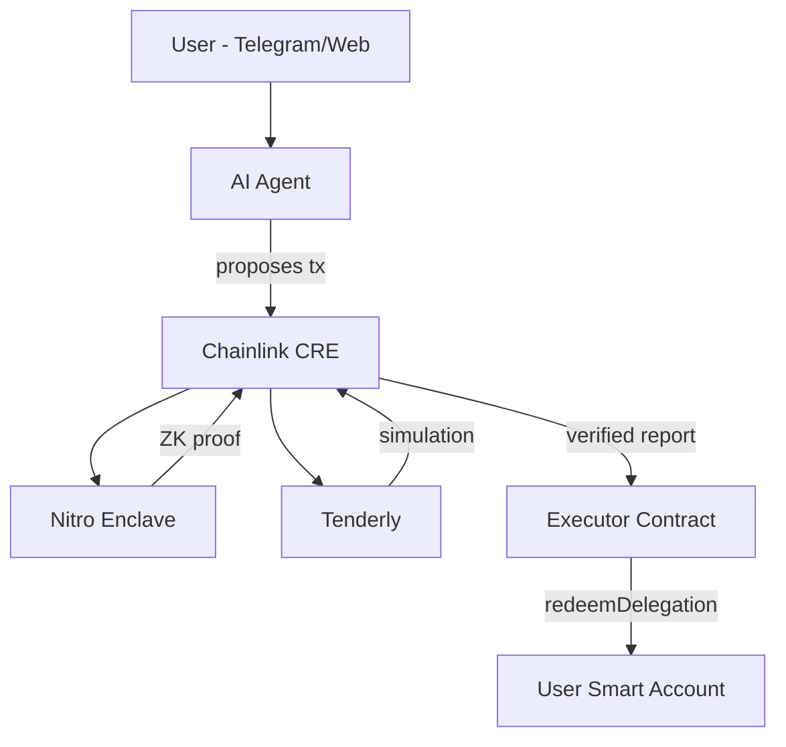

# Autonomify

**On-demand AI Agents.**

AI agents are becoming a popular interface for Web3, but cannot be completely trusted to execute on-chain transactions. Granting agents execution authority exposes systems to prompt injection, memory poisoning, and model manipulation. Human approval breaks autonomy and prevents automation. This creates an execution dilemma for autonomous systems.

Autonomify solves this by separating **proposal** from **authorization** from **execution**:

- **Agents propose** transactions but never hold keys
- **ZK proofs verify** policy compliance without revealing policies
- **CRE orchestrates** the secure workflow across enclave, simulation, and chain
- **Delegated execution** via ERC-7710 lets the user's smart account remain `msg.sender`

## How It's Built

| Integration | Documentation | Key Code |
|-------------|---------------|----------|
| **Chainlink CRE** | [docs/CRE.md](docs/CRE.md) | [`packages/autonomify-cre/executor/index.ts`](packages/autonomify-cre/executor/index.ts) |
| **Tenderly** | [docs/TENDERLY.md](docs/TENDERLY.md) | [`packages/autonomify-cre/executor/lib/tenderly.ts`](packages/autonomify-cre/executor/lib/tenderly.ts) |
| **ERC-7710 Delegation** | [docs/DELEGATION.md](docs/DELEGATION.md) | [`contracts/src/AutonomifyExecutor.sol:128`](contracts/src/AutonomifyExecutor.sol#L128) |
| **ZK Proofs (Noir)** | [docs/ZK.md](docs/ZK.md) | [`circuits/noir/autonomify/src/main.nr:8`](circuits/noir/autonomify/src/main.nr#L8) |


## What We Built

| Component | Description |
|-----------|-------------|
| **autonomify-sdk** | Universal tool for AI agents to call any contract |
| **autonomify-app** | Dashboard + API + on-demand hosted Telegram agents as reference implementations |
| **AutonomifyExecutor** | On-chain router with audit trail |


## Testing Guide 

### Quick Test: AI Agent Demo (5 minutes)

Run the AI agent test to see the full flow: AI understands requests → encodes transactions → triggers CRE workflow.

```bash
cd packages/autonomify-cre

```

Edit `executor/config.staging.json`:
```json
{
  "enclaveUrl": "http://3.71.199.191:8001",
  "executorAddress": "0xD44def7f75Fea04B402688FF14572129D2BEeb05",
  "authorizedKey": "0xYOUR_WALLET_ADDRESS",
  "chainSelector": "10344971235874465080",
  "tenderlyRpc": "https://base-sepolia.gateway.tenderly.co/YOUR_KEY",
  "virtualTestnetRpc": "https://virtual.base-sepolia.eu.rpc.tenderly.co/YOUR_VNET_ID"
}
```
```bash

cp .env.example .env
```

Edit `.env` (in autonomify-cre root):
```env
CRE_ETH_PRIVATE_KEY=your_private_key_for_authorizedKey
OPENAI_API_KEY=sk-your-openai-key
```
```bash

```bash

# Install and run
cd executor
bun install
bun run test
```

**Expected output:**
```
════════════════════════════════════════════════════════════
  AUTONOMIFY AI AGENT TEST
════════════════════════════════════════════════════════════
  Owner: 0x16e0e714...2f2a3720
  CRE URL: http://localhost:8080/trigger
  Chain: Base Sepolia (84532)
  Running: 3 scenario(s)

────────────────────────────────────────────────────────────
  SCENARIO: Check LINK balance
────────────────────────────────────────────────────────────
  User: What's my LINK balance?
  -> Calling balanceOf on 0xe4ab69c0...
  [OK] 0.808 LINK
  Agent: Your LINK balance is 0.808 LINK.

────────────────────────────────────────────────────────────
  SCENARIO: Get swap quote
────────────────────────────────────────────────────────────
  User: Get me a quote to swap 0.1 LINK for WETH
  -> Calling quoteExactInputSingle on 0xc5290058...
  [OK] {"amountOut":"0.000005282563324959"...}
  Agent: The quote to swap 0.1 LINK for WETH is approximately 0.00000528 WETH.

  Total: 3 passed, 0 failed
════════════════════════════════════════════════════════════
```

**Run specific test categories:**
```bash
bun run test:balance    # Token balance checks
bun run test:quote      # DEX quotes with tuple encoding
```
---


## Deployments

| Network | Addresses |
|---------|-----------|
| Base Sepolia | [docs/base-sepolia.address](docs/base-sepolia.address) |

---


### Telegram vs Self-Hosted

| Feature | Telegram (Hosted) | Self-Hosted |
|---------|-------------------|-------------|
| System Prompt | Auto-generated with agent identity | You generate via SDK or custom |
| Execution | Routed through our API | Direct CRE calls |
| Conversation | Stored encrypted in our DB | Your responsibility |
| Customization | Limited | Full control |


---

## Architecture



**Key insight**: The AI agent never holds execution authority. CRE orchestrates ZK proof generation from the enclave, pre-flight simulation via Tenderly, and delegated execution on the user's smart account.

## Repository

```
├── app/                       # Next.js dashboard + Telegram bot
├── packages/
│   ├── autonomify-sdk/        # Universal AI agent tool
│   ├── autonomify-cre/        # CRE workflow (Chainlink)
│   └── autonomify-enclave/    # AWS Nitro Enclave (ZK proofs)
├── contracts/                 # Solidity (Executor, HonkVerifier)
├── circuits/                  # Noir ZK circuits
└── docs/                      # CRE & Tenderly Integration docs, deployments addresses
```

## Tech Stack

- **Chainlink CRE** - Workflow orchestration, on-chain writes
- **Tenderly** - Transaction simulation, execution verification
- **AWS Nitro Enclave** - Secure ZK proof generation
- **Noir + UltraHonk** - Zero-knowledge policy verification
- **MetaMask Delegation (ERC-7710)** - Delegated smart account execution
- **Vercel AI SDK** - Agent LLM integration
- **Next.js + Telegram Bot API** - Demo User interfaces
