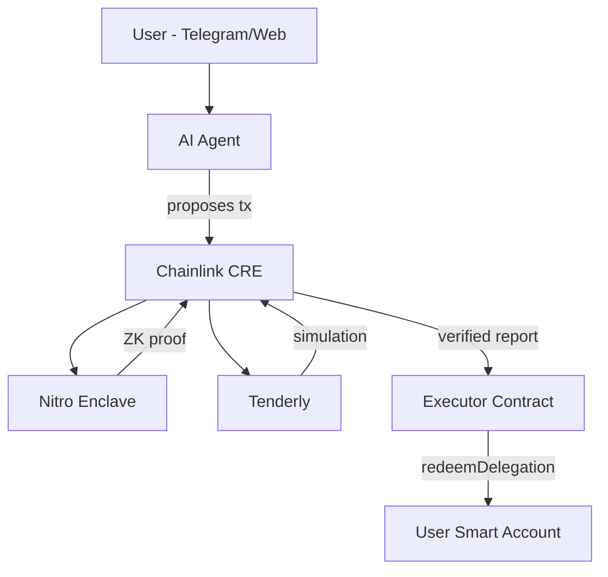

# Autonomify

**On-demand AI Agents.**

AI agents are becoming a popular interface for Web3, but cannot be completely trusted to execute on-chain transactions. Granting agents execution authority exposes systems to prompt injection, memory poisoning, and model manipulation. Human approval breaks autonomy and prevents automation. This creates an execution dilemma for autonomous systems.

Autonomify solves this by separating **proposal** from **authorization** from **execution**:

- **Agents propose** transactions but never hold keys
- **ZK proofs verify** policy compliance without revealing policies
- **CRE orchestrates** the secure workflow across enclave, simulation, and chain
- **Delegated execution** via ERC-7710 lets the user's smart account remain `msg.sender`

## How It's Built

| Integration | Documentation | Key Code |
|-------------|---------------|----------|
| **Chainlink CRE** | [docs/CRE.md](docs/CRE.md) | [`packages/autonomify-cre/executor/index.ts`](packages/autonomify-cre/executor/index.ts) |
| **Tenderly** | [docs/TENDERLY.md](docs/TENDERLY.md) | [`packages/autonomify-cre/executor/lib/tenderly.ts`](packages/autonomify-cre/executor/lib/tenderly.ts) |
| **ERC-7710 Delegation** | [docs/DELEGATION.md](docs/DELEGATION.md) | [`contracts/src/AutonomifyExecutor.sol:128`](contracts/src/AutonomifyExecutor.sol#L128) |
| **ZK Proofs (Noir)** | [AUTONOMIFY_ARCHITECTURE.md](AUTONOMIFY_ARCHITECTURE.md#zk-policy-system) | [`circuits/noir/src/main.nr`](circuits/noir/src/main.nr) |


## What We Built

| Component | Description |
|-----------|-------------|
| **autonomify-sdk** | Universal tool for AI agents to call any contract |
| **autonomify-app** | Dashboard + API + on-demand hosted Telegram agents as reference implementations |
| **AutonomifyExecutor** | On-chain router with audit trail |


## Local Development

### Prerequisites

To run locally, you'll need:

| Tool | Version | Install |
|------|---------|---------|
| **Node.js** | 20+ | [nodejs.org](https://nodejs.org) |
| **pnpm** | 8+ | `npm install -g pnpm` |
| **Bun** | 1.0+ | `curl -fsSL https://bun.sh/install \| bash` |
| **ngrok** | 3+ | `brew install ngrok` or [ngrok.com](https://ngrok.com) |
| **CRE CLI** | latest | [Chainlink CRE docs](https://docs.chain.link/cre) |

### Required API Keys

Create `app/.env.local` from `app/.env.example` and fill in:

```env
OPENAI_API_KEY=        # For AI agent LLM
PRIVY_ID=              # Wallet connection for frontend testing (privy.io)
PRIVY_SECRET=
DATABASE_URL=          # Postgres (e.g., Neon)
```

```bash
# Clone and install
git clone https://github.com/your-repo/autonomify
cd autonomify
pnpm install

# Configure environment
cp app/.env.example app/.env.local
# Edit app/.env with your API keys

# Start everything (ngrok + CRE + app)
pnpm start
```

This will:
1. Start ngrok tunnel and auto-inject the URL into `.env.local`
2. Start CRE workflow simulation with `--broadcast`
3. Start the Next.js dev server

Open `http://localhost:3000` (or the ngrok URL for Telegram webhooks).

---

## Deployments

| Network | Addresses |
|---------|-----------|
| Base Sepolia | [docs/base-sepolia.address](docs/base-sepolia.address) |

---

## Quick Start

### Option 1: Hosted Telegram Bot (Easiest)

1. Go to [autonomify.vercel.app](https://autonomify.vercel.app)
2. Paste a verified contract address → Click "Launch Agent" → Choose "Telegram"
3. Enter your bot token (from [@BotFather](https://t.me/BotFather))
4. Start chatting with your bot — we handle the smart wallet ([via Privy](https://docs.privy.io))

### Option 2: Self-hosted Agent

1. Go to [autonomify.vercel.app](https://autonomify.vercel.app)
2. Paste a verified contract address → Click "Launch Agent" → Choose "Self-hosted"
3. Download your `autonomify.json` config file
4. Use the SDK with your AI framework:

```typescript
import { forVercelAI } from "autonomify-sdk"
import { generateText } from "ai"
import config from "./autonomify.json"

const { tool, prompt } = forVercelAI({
  export: config,
  agentId: config.agentId,
  signAndSend: async (tx) => {
    // Route to CRE for trustless execution
    return executeViaCRE({ ...tx, delegation })
  }
})

const { text } = await generateText({
  model: openai("gpt-4o"),
  tools: { autonomify_execute: tool },
  system: prompt,
  prompt: "Transfer 100 USDT to 0x..."
})
```


## Architecture



**Key insight**: The AI agent never holds execution authority. CRE orchestrates ZK proof generation from the enclave, pre-flight simulation via Tenderly, and delegated execution on the user's smart account.

## Repository

```
├── app/                       # Next.js dashboard + Telegram bot
├── packages/
│   ├── autonomify-sdk/        # Universal AI agent tool
│   ├── autonomify-cre/        # CRE workflow (Chainlink)
│   └── autonomify-enclave/    # AWS Nitro Enclave (ZK proofs)
├── contracts/                 # Solidity (Executor, HonkVerifier)
├── circuits/                  # Noir ZK circuits
└── docs/                      # CRE & Tenderly Integration docs, deployments addresses
```

## Tech Stack

- **Chainlink CRE** - Workflow orchestration, on-chain writes
- **Tenderly** - Transaction simulation, execution verification
- **AWS Nitro Enclave** - Secure ZK proof generation
- **Noir + UltraHonk** - Zero-knowledge policy verification
- **MetaMask Delegation (ERC-7710)** - Delegated smart account execution
- **Vercel AI SDK** - Agent LLM integration
- **Next.js + Telegram Bot API** - Demo User interfaces
