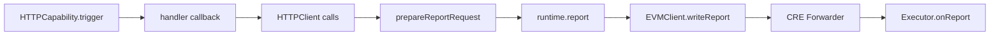

# Chainlink CRE Integration

Autonomify uses Chainlink CRE (Compute Runtime Environment) to orchestrate secure AI agent execution workflows.

## Code References

| Component | File | Description |
|-----------|------|-------------|
| CRE Workflow | [`packages/autonomify-cre/executor/index.ts`](../packages/autonomify-cre/executor/index.ts) | Main workflow entry |
| HTTPCapability | [`index.ts:267`](../packages/autonomify-cre/executor/index.ts#L267) | CRE HTTP trigger capability |
| HTTPClient | [`index.ts:259`](../packages/autonomify-cre/executor/index.ts#L259) | CRE HTTP client for external calls |
| EVMClient | [`index.ts:168`](../packages/autonomify-cre/executor/index.ts#L168) | CRE EVM client for chain interaction |
| prepareReportRequest | [`index.ts:164`](../packages/autonomify-cre/executor/index.ts#L164) | CRE report preparation |
| runtime.report() | [`index.ts:165`](../packages/autonomify-cre/executor/index.ts#L165) | CRE signed report creation |
| writeReport() | [`index.ts:170`](../packages/autonomify-cre/executor/index.ts#L170) | CRE on-chain submission |
| IReceiver | [`contracts/src/interfaces/IReceiver.sol`](../contracts/src/interfaces/IReceiver.sol) | CRE receiver interface |
| onReport() | [`AutonomifyExecutor.sol:51`](../contracts/src/AutonomifyExecutor.sol#L51) | CRE Forwarder callback |

## CRE SDK Imports

```typescript
import {
  HTTPCapability,
  HTTPClient,
  EVMClient,
  handler,
  Runner,
  prepareReportRequest,
  type Runtime,
  type HTTPPayload,
} from "@chainlink/cre-sdk";
```

## Execution Flow



## Key CRE Functions

| Function | Purpose |
|----------|---------|
| `HTTPCapability.trigger()` | Define HTTP trigger with authorized keys |
| `handler()` | Wrap trigger with callback function |
| `HTTPClient.sendRequest()` | Make external HTTP calls with consensus |
| `prepareReportRequest()` | Encode payload for signed report |
| `runtime.report()` | Create DON-signed report |
| `EVMClient.writeReport()` | Submit report on-chain via CRE Forwarder |

## Gas Configuration

CRE writeReport requires sufficient gas for ZK verification (~2M gas). Always set `gasLimit: "3000000"`.

## Commands

```bash
cd packages/autonomify-cre/executor
bun run serve.ts
```

## Deployments

| Contract | Address |
|----------|---------|
| CRE Forwarder | `0x82300bd7c3958625581cc2F77bC6464dcEcDF3e5` |

See [base-sepolia.address](base-sepolia.address) for demo contracts and transaction hashes
