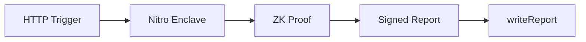
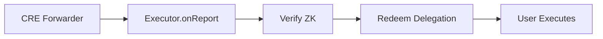

# Chainlink CRE Integration

Autonomify uses Chainlink CRE to orchestrate secure AI agent execution workflows.

## Code References

| Component | File | Lines |
|-----------|------|-------|
| CRE Workflow Entry | [`packages/autonomify-cre/executor/index.ts`](../packages/autonomify-cre/executor/index.ts) | Main workflow |
| HTTP Trigger & Payload | [`index.ts:25-50`](../packages/autonomify-cre/executor/index.ts#L25-L50) | Extract execution request |
| ZK Proof Request | [`lib/enclave.ts:10`](../packages/autonomify-cre/executor/lib/enclave.ts#L10) | `requestZkProof()` |
| Report Submission | [`index.ts:171`](../packages/autonomify-cre/executor/index.ts#L171) | `writeReport()` |
| Executor Contract | [`contracts/src/AutonomifyExecutor.sol`](../contracts/src/AutonomifyExecutor.sol) | IReceiver implementation |
| `onReport()` Handler | [`AutonomifyExecutor.sol:51`](../contracts/src/AutonomifyExecutor.sol#L51) | CRE Forwarder callback |
| Nullifier Tracking | [`AutonomifyExecutor.sol:17`](../contracts/src/AutonomifyExecutor.sol#L17) | Replay protection |
| Delegation Redemption | [`AutonomifyExecutor.sol:115`](../contracts/src/AutonomifyExecutor.sol#L115) | `_redeemDelegation()` |
| IReceiver Interface | [`interfaces/IReceiver.sol:5`](../contracts/src/interfaces/IReceiver.sol#L5) | `onReport()` signature |

## Execution Flow

**CRE Workflow:**


**On-Chain:**


## Key Functions

**CRE Workflow** ([`index.ts`](../packages/autonomify-cre/executor/index.ts)):
- `HTTPTrigger` - receives execution requests
- `requestZkProof()` - calls Nitro Enclave ([`lib/enclave.ts:10`](../packages/autonomify-cre/executor/lib/enclave.ts#L10))
- `runtime.report()` - creates signed report
- `writeReport()` - submits on-chain ([`index.ts:171`](../packages/autonomify-cre/executor/index.ts#L171))

**Executor Contract** ([`AutonomifyExecutor.sol`](../contracts/src/AutonomifyExecutor.sol)):
- `onReport()` - CRE Forwarder callback ([line 51](../contracts/src/AutonomifyExecutor.sol#L51))
- `usedNullifiers` - replay protection ([line 17](../contracts/src/AutonomifyExecutor.sol#L17))
- `_redeemDelegation()` - execute via DelegationManager ([line 115](../contracts/src/AutonomifyExecutor.sol#L115))

## Gas Configuration

ZK verification requires ~2M gas. Always set `gasLimit: "3000000"`.

## Commands

```bash
cd packages/autonomify-cre/executor
~/bin/cre workflow simulate --workflow index.ts --config config.staging.json --broadcast
```

## Deployments

See [base-sepolia.address](base-sepolia.address)
