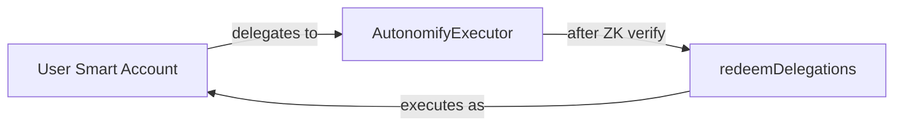

# ERC-7710 Delegation Integration

Autonomify uses MetaMask's Delegation Framework (ERC-7710) to enable trustless execution on behalf of users.

## Overview

Users grant an **open delegation** to the `AutonomifyExecutor` contract. The executor can then redeem this delegation to execute transactions as the user's smart account - but only after ZK proof verification passes.

## Code References

| Component | File | Lines |
|-----------|------|-------|
| IDelegationManager Interface | [`contracts/src/interfaces/IDelegationManager.sol`](../contracts/src/interfaces/IDelegationManager.sol) | Interface |
| Executor Delegation Setup | [`AutonomifyExecutor.sol:13`](../contracts/src/AutonomifyExecutor.sol#L13) | `delegationManager` address |
| Redeem Delegation | [`AutonomifyExecutor.sol:128`](../contracts/src/AutonomifyExecutor.sol#L128) | `redeemDelegations()` call |
| Delegation Creation (App) | [`app/src/lib/delegation.ts`](../app/src/lib/delegation.ts) | Frontend signing flow |

## Delegation Model

## Key Concepts

| Term | Description |
|------|-------------|
| **Delegator** | User's smart account (holds funds) |
| **Delegate** | AutonomifyExecutor contract |
| **Caveats** | Empty `[]` - ZK proof enforces all policies |
| **permissionsContext** | Encoded delegation + signature for redemption |

## Why Open Delegation?

Traditional delegations use on-chain caveats (spend limits, whitelists). Autonomify uses **open delegation** with no caveats because:

1. ZK proof verification happens before delegation redemption
2. Policies are enforced in the Nitro Enclave (private)
3. On-chain caveats would be redundant and gas-expensive

## Execution Flow

1. User signs delegation once (grants Executor permission)
2. Agent proposes transaction
3. CRE requests ZK proof from enclave
4. Proof verified on-chain in `onReport()`
5. Executor calls `DelegationManager.redeemDelegations()`
6. User's smart account executes the action

## Deployed DelegationManager

| Network | Address |
|---------|---------|
| Base Sepolia | `0xdb9B1e94B5b69Df7e401DDbedE43491141047dB3` |

See [base-sepolia.address](base-sepolia.address) for all contracts.
