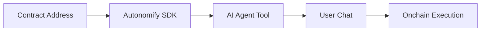
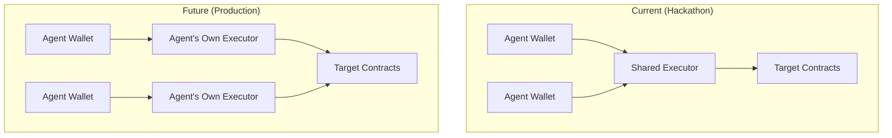

# Project: Problem, Solution & Impact

## 1. Problem

AI agents can't easily interact with smart contracts:
- **Developers** must manually write tools for each contract function
- **Users** need technical knowledge to execute onchain actions
- **No standard** for AI-to-contract communication

And when they do, it's risky:
- **Key exposure** — agents need wallet access, but embedding keys is dangerous
- **No audit trail** — hard to track what an agent executed and why
- **Uncontrolled scope** — agents can call any function, no guardrails

## 2. Solution

**Autonomify** provides a universal SDK that turns any verified contract into an AI-usable tool.

**How it works:**
1. Paste any verified BNB contract address
2. SDK generates tool definitions from ABI
3. AI agent understands available functions
4. User requests execute via natural language
5. Transactions route through auditable executor

**Key features:**
- Zero-config contract understanding
- Works with any LLM (OpenAI, Vercel AI SDK)
- Wallet-agnostic (bring your own signer)
- On-chain audit trail via executor contract
- Hosted option: deploy a Telegram bot in seconds, we manage the wallet

## 3. Business & Ecosystem Impact

**Target users:**
- AI developers building onchain agents
- DApp builders adding conversational UX
- Non-technical users via Telegram bots

**Ecosystem value:**
- Lowers barrier to BNB Chain interaction
- Enables new AI agent use cases
- Standard interface for agent tooling

## 4. Limitations & Future Work

**Current:**
- BSC Testnet only
- Requires verified contracts
- Shared executor (all agents use same contract)

**Security Roadmap:**

**Per-Agent Executor (CREATE2):**
1. Each agent gets its own Executor via CREATE2 (deterministic address)
2. Address computed BEFORE deployment from `factory + agentId`
3. Privy wallet policy whitelists ONLY that executor address
4. Tokens held in agent's personal executor = full isolation
5. Deploy lazily on first transaction (gas efficient)

**Benefits:**
- Agent can ONLY call its own executor (policy enforced)
- Even if compromised, can't drain to arbitrary addresses
- Full audit trail per agent
- Token isolation between agents
