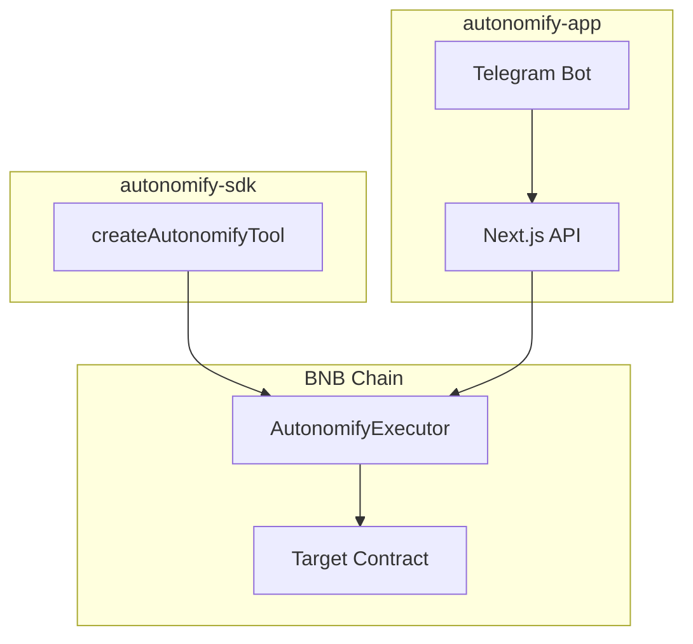

# Technical: Architecture, Setup & Demo

## 1. Architecture



**Components:**

| Component | Purpose |
|-----------|---------|
| `autonomify-sdk` | Universal tool for AI agents |
| `create-autonomify` | CLI to scaffold agent projects |
| `autonomify-app` | Dashboard + API + hosted bots |
| `AutonomifyExecutor` | On-chain router with audit trail |

**Data flow:**
1. User message → Telegram/SDK
2. LLM generates tool call
3. SDK encodes transaction
4. Wallet signs → Executor → Target contract
5. Result returned to user

## 2. Setup & Run

**Prerequisites:**
- Node.js 18+
- pnpm
- OpenAI API key
- Privy account (for hosted agents)

**Install:**
```bash
git clone <repo>
cd autonomify
pnpm install
```

**Environment (autonomify-app/.env):**
```env
OPENAI_API_KEY=sk-...
PRIVY_APP_ID=...
PRIVY_APP_SECRET=...
BSCSCAN_API_KEY=...
DATABASE_URL=postgres://...
NEXT_PUBLIC_BASE_URL=https://...
```

**Run:**
```bash
pnpm dev  # Starts autonomify-app on :3000
```

## 3. Demo Guide

**Option A: Use the SDK**
```bash
npx create-autonomify my-agent
cd my-agent
# Add your agent config to autonomify.json
pnpm dev
```

**Option B: Hosted Telegram Bot**
1. Open [autonomify.vercel.app](https://autonomify.vercel.app)
2. Paste a contract address (e.g., USDT on BSC Testnet)
3. Click "Create Agent" → enter Telegram bot token
4. Chat with your bot

**Key actions to try:**
- "What functions does this contract have?"
- "Transfer 10 tokens to 0x..."
- "Check balance of 0x..."

## 4. Deployments

| Network | Contract | Address |
|---------|----------|---------|
| BSC Testnet | AutonomifyExecutor | `0xC62AeB774DF09a6C2554dC19f221BDc4DFfAD93C` |

[View on BscScan](https://testnet.bscscan.com/address/0xC62AeB774DF09a6C2554dC19f221BDc4DFfAD93C)
