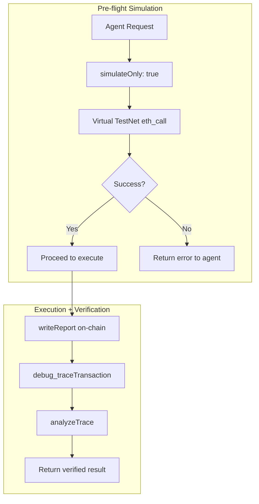

# Tenderly Integration

Autonomify uses Tenderly for transaction simulation and execution verification.

## Why Tenderly?

CRE's `writeReport()` returns `txStatus: SUCCESS` based on **transaction inclusion**, not internal execution success. Internal calls may revert silently. Tenderly's `debug_traceTransaction` reveals the actual outcome.

## Code References

| Component | File | Lines |
|-----------|------|-------|
| Tenderly Service | [`packages/autonomify-cre/executor/lib/tenderly.ts`](../packages/autonomify-cre/executor/lib/tenderly.ts) | Simulation & tracing |
| Pre-flight Simulation | [`lib/tenderly.ts:88`](../packages/autonomify-cre/executor/lib/tenderly.ts#L88) | `simulateOnVirtualTestnet()` |
| Post-execution Trace | [`lib/tenderly.ts:148`](../packages/autonomify-cre/executor/lib/tenderly.ts#L148) | `fetchTransactionTrace()` |
| Trace Analyzer | [`lib/trace-analyzer.ts:12`](../packages/autonomify-cre/executor/lib/trace-analyzer.ts#L12) | `analyzeTrace()` |
| CRE Integration | [`index.ts:92`](../packages/autonomify-cre/executor/index.ts#L92) | Simulation call in workflow |

## Two-Phase Flow



## Key Functions

| Function | Location | Purpose |
|----------|----------|---------|
| `simulateOnVirtualTestnet()` | [`tenderly.ts:88`](../packages/autonomify-cre/executor/lib/tenderly.ts#L88) | Pre-flight `eth_call` on Virtual TestNet |
| `fetchTransactionTrace()` | [`tenderly.ts:148`](../packages/autonomify-cre/executor/lib/tenderly.ts#L148) | Post-execution `debug_traceTransaction` |
| `analyzeTrace()` | [`trace-analyzer.ts:12`](../packages/autonomify-cre/executor/lib/trace-analyzer.ts#L12) | Parse call tree, find failures |

## Error Handling

| Error | Contract | Action |
|-------|----------|--------|
| `ShpleminiFailed` | HonkVerifier | Increase gas to 3M+ |
| `InvalidProof` | AutonomifyExecutor | Regenerate proof |
| `PolicyNotSatisfied` | AutonomifyExecutor | Check policy config |
| `NullifierAlreadyUsed` | AutonomifyExecutor | Fresh timestamp |

## Configuration

```json
{
  "tenderlyRpc": "https://base-sepolia.gateway.tenderly.co/<GATEWAY_KEY>",
  "virtualTestnetRpc": "https://virtual.base-sepolia.eu.rpc.tenderly.co/b4f2be99-9418-431a-863f-95d1d80bbb04"
}
```

- **Virtual TestNet ID:** `b4f2be99-9418-431a-863f-95d1d80bbb04`

See [`config.staging.json`](../packages/autonomify-cre/executor/config.example.json)
