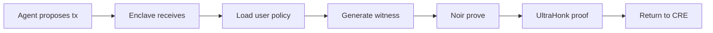

# ZK Policy Verification (Noir)

Autonomify uses Noir circuits with UltraHonk proofs to verify policy compliance without revealing the policies themselves.

## Code References

| Component | File | Lines |
|-----------|------|-------|
| Main Circuit | [`circuits/noir/autonomify/src/main.nr:8`](../circuits/noir/autonomify/src/main.nr#L8) | `main()` entry point |
| Merkle Verification | [`circuits/noir/autonomify/src/merkle.nr:5`](../circuits/noir/autonomify/src/merkle.nr#L5) | `compute_merkle_root()` |
| Amount Policy | [`circuits/noir/autonomify/src/policies/amount.nr:2`](../circuits/noir/autonomify/src/policies/amount.nr#L2) | `check_max_amount()` |
| Time Policy | [`circuits/noir/autonomify/src/policies/time.nr:2`](../circuits/noir/autonomify/src/policies/time.nr#L2) | `check_time_window()` |
| Whitelist Policy | [`circuits/noir/autonomify/src/policies/whitelist.nr:5`](../circuits/noir/autonomify/src/policies/whitelist.nr#L5) | `check_whitelist()` |
| On-chain Verifier | [`contracts/src/HonkVerifier.sol`](../contracts/src/HonkVerifier.sol) | UltraHonk verifier |

## Supported Policies

| Policy | Description | Private Inputs |
|--------|-------------|----------------|
| **Max Amount** | Transaction value ≤ limit | `tx_amount`, `max_amount` |
| **Time Window** | Execute only during hours | `tx_timestamp`, `allowed_start_hour`, `allowed_end_hour` |
| **Whitelist** | Recipient in Merkle tree | `tx_recipient`, `whitelist_root`, `whitelist_path`, `whitelist_index` |

## Proof Flow

## Public Outputs

The circuit produces three public outputs verified on-chain:

| Output | Description |
|--------|-------------|
| `policy_satisfied` | `1` if all enabled policies pass |
| `nullifier` | Pedersen hash preventing replay |
| `user_address_hash` | Identifies the policy owner |

## Nitro Enclave

Proofs are generated inside an AWS Nitro Enclave for secure, isolated execution.

| Property | Value |
|----------|-------|
| **Enclave Name** | `autonomify-enclave` |
| **Memory** | 4096 MiB |
| **CPUs** | 2 |
| **PCR0** | `832987dc4fac1e9566c6a1c40eb4d1da22f7f3345ba46524ae9446c462b96d48a688871a48115657b319e78e4e2bd3f6` |
| **PCR1** | `0343b056cd8485ca7890ddd833476d78460aed2aa161548e4e26bedf321726696257d623e8805f3f605946b3d8b0c6aa` |
| **PCR2** | `2cad6236eef48a85bbbda439179473ed82bc0cb761b2f414ba7f908f7d623536f2d442181c481385722f46793ccfea08` |

PCR values are cryptographic measurements of the enclave image, enabling remote attestation.

## Why ZK?

1. **Policy Privacy** - Users don't reveal spending limits or whitelists
2. **Trustless Verification** - On-chain verifier confirms compliance
3. **Composable Policies** - Enable/disable policies per user via flags
